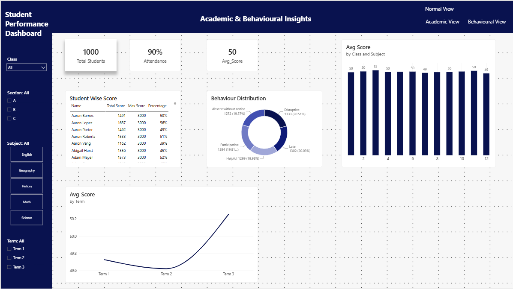
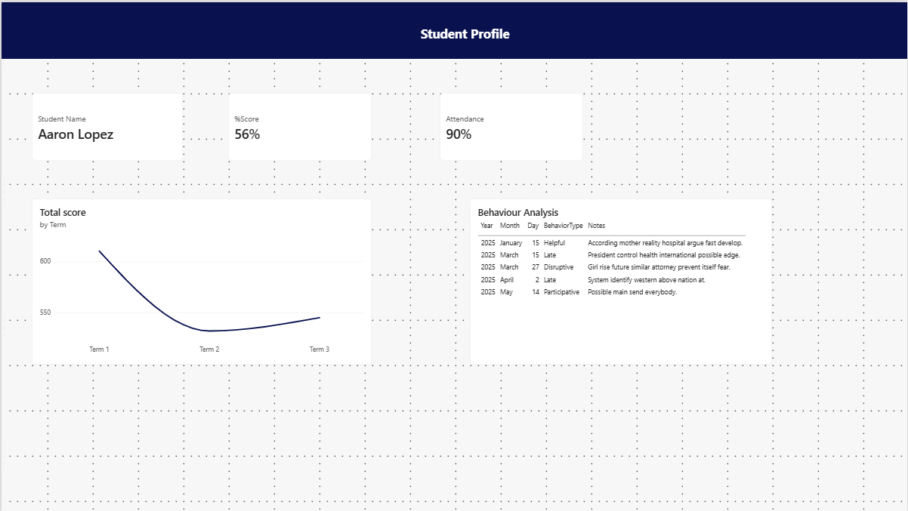

<div align="center">


<br/>

[](https://powerbi.microsoft.com/)
[](/)
[](/)
[](/)
[](LICENSE)

<br/>

> **A comprehensive Power BI dashboard** that unifies academic scores, attendance records, and behavioural data into a single pane of glass — empowering educators and administrators with actionable, real-time insights.

</div>

---

## 🖼️ Dashboard Preview

<div align="center">

### 📊 Main Dashboard — Academic & Behavioural Overview



<br/><br/>

### 👤 Student Profile — Individual Drill-Down View



</div>

---

## 📋 Table of Contents

- [Overview](#-overview)
- [Dashboard Views](#-dashboard-views)
- [Key Metrics at a Glance](#-key-metrics-at-a-glance)
- [Key Insights](#-key-insights)
- [Features](#-features)
- [Getting Started](#-getting-started)
- [Data Sources](#-data-sources)
- [Actionable Recommendations](#-actionable-recommendations)
- [Project Structure](#-project-structure)

---

## 🔍 Overview

The **Student Performance Dashboard** is a multi-view Power BI report designed for school administrators, class teachers, and academic coordinators. It consolidates three core data streams — **Academics**, **Attendance**, and **Behaviour** — to surface trends that would otherwise remain hidden in raw spreadsheets.

The dashboard supports **dynamic filtering** by Class, Section (A/B/C), Subject, and Term, and includes both a high-level school overview and a granular per-student profile drill-through.

---

## 🖥️ Dashboard Views

<div align="center">

| 🏠 Normal View | 📚 Academic View | 🧠 Behavioural View | 👤 Student Profile |
|:-:|:-:|:-:|:-:|
| School-wide KPIs | Score trends by term | Behaviour distribution | Individual drill-down |
| Total students, avg score & attendance | Class × Subject breakdown | Score timeline + behaviour log |

</div>


## 💡 Key Insights

### 1. 📉 Academic Volatility — The "Inconsistency" Trend

> A review of the Scores data reveals significant volatility in individual student performance across different exam types (Unit Tests vs. Mid Terms vs. Final Exams).

```
Student A (Science) →  88%  ──────╮
                                   ╰──▶  drop to  18%  on next exam
```

**Implication:** High class averages may be masking severe knowledge gaps in specific terms or units. Consistent subject mastery is lacking across the cohort.

---

### 2. 🧩 Behaviour Distribution — Surprisingly Balanced

The behaviour log tracks five incident types. Their distribution across ~6,500 logged events is nearly equal — a sign of consistent teacher logging:

```
Disruptive            ████████████████████  1,333  (20.51%)
Late                  ███████████████████   1,302  (20.03%)
Helpful               ███████████████████   1,299  (19.98%)
Participative         ███████████████████   1,294  (19.91%)
Absent without notice ██████████████████    1,272  (19.57%)
```

**Implication:** Students in the **Low academic category** likely show a disproportionately high share of *Disruptive* or *Absent without notice* events — a correlation worth investigating per student profile.

---

### 3. 🔍 The "Hidden" Attendance Factor

While school-wide attendance appears stable at **90%**, individual student drill-downs reveal patterns of **intermittent, unexcused absences** logged as *"Absent without notice"* in the behaviour table.

```
School Average:    ████████████████████ 90%   ✅ Looks fine
Individual (Low):  ████████████         ~60%  ⚠️ Hidden risk
```

**Implication:** Chronic absenteeism is likely the **leading indicator** of a student falling into the Low Performance Category (below 40%). The student profile view makes this pattern immediately visible.

---

### 4. 📊 Term-on-Term Score Trend

Average scores dipped in **Term 2** then recovered sharply by **Term 3**, suggesting mid-year fatigue or difficulty spikes with a strong finish.

```
Term 1  ──49.7──╮
                 ╰── Term 2 ──49.6── (lowest)
                                      ╰──── Term 3 ──50.3+  📈
```

---

## ✨ Features

- 🔎 **Dynamic Filtering** — Slice data by class, section, subject, and term simultaneously
- 👤 **Student Profile Drill-Through** — Click any student to see their full score timeline & behaviour log
- 📊 **Score Trend Lines** — Term-on-term trajectory at school-wide and individual level
- 🍩 **Behaviour Distribution Donut Chart** — Proportional share of each behaviour type
- 🏫 **Class × Subject Bar Chart** — Average scores broken down by class (2–12) and subject
- 📋 **Sortable Student-Wise Score Table** — Name, total score, max score, and percentage
- 🎛️ **Multi-View Navigation** — Switch between Normal, Academic, and Behavioural views instantly

---

## 🚀 Getting Started

### Prerequisites

- [Power BI Desktop](https://powerbi.microsoft.com/desktop/) (latest version recommended)
- Access to the underlying data sources (see [Data Sources](#-data-sources))

### Installation

```bash
# 1. Clone this repository
git clone https://github.com/your-username/student-performance-dashboard.git

# 2. Navigate to the project folder
cd student-performance-dashboard

# 3. Open the report
start StudentPerformanceDashboard.pbix
```

### Connecting Your Data

1. Open the `.pbix` file in **Power BI Desktop**
2. Navigate to **Home → Transform Data → Data Source Settings**
3. Update file paths or database connection strings to point to your institution's data
4. Click **Refresh** — the entire report updates automatically

---

## 🗄️ Data Sources

The dashboard is built on three interconnected tables:

| Table | Key Fields | Description |
|-------|-----------|-------------|
| 🧠 **Behaviour** | StudentID, Date, Behaviour Type, Notes | Teacher-logged behavioural incident records |
| 📅 **Attendance** | StudentID, Date, Status, Reason | Daily attendance records (present / absent) |
| 📝 **Scores** | StudentID, Subject, ExamType, Score, MaxScore, Term | Term-Wise Student Performance |
| 📝 **Student** | StudentID, Gender, Class, Section | Student Details |

> Data can be sourced from **CSV files**. Update the Power Query connections accordingly.

---

## 📌 Actionable Recommendations

Based on dashboard insights, the following interventions are recommended:

| # | Recommendation | Priority |
|---|---------------|----------|
| 🚨 | **Early Warning System** — Flag students dropping below **40%** (Low category) for immediate academic intervention | 🔴 High |
| 📐 | **Standardise Grading** — Investigate subjects with the highest score volatility; inconsistent test difficulty may be masking true ability | 🟡 Medium |
| 🏆 | **Behavioural Rewards Programme** — Recognise students with highest *Participative* & *Helpful* logs to reinforce positive classroom culture | 🟢 Normal |

---

## 📁 Project Structure

```
student-performance-dashboard/
│
├── 📊  StudentPerformanceDashboard.pbix   ← Main Power BI report
│
├── 📂  data/
│   ├── academics.csv                      ← Raw academic scores
│   ├── attendance.csv                     ← Daily attendance records
│   └── behaviour.csv                      ← Behavioural incident log
│
├── 📂  assets/
│   ├── dashboard-main.png                 ← Main dashboard screenshot
│   └── dashboard-profile.png             ← Student profile screenshot
│
├── 📄  Key_Insights_Report.docx           ← Analytical summary document
└── 📄  README.md                          ← You are here
```

---

## 🤝 Contributing

Contributions, issues, and feature requests are welcome!

1. **Fork** the repository
2. Create your feature branch: `git checkout -b feature/amazing-feature`
3. Commit your changes: `git commit -m 'Add amazing feature'`
4. Push to the branch: `git push origin feature/amazing-feature`
5. Open a **Pull Request**

---

## 📄 License

This project is licensed under the [MIT License](LICENSE).

---

<div align="center">

**Made with ❤️ by CHIRAG MODI for better educational outcomes**

<br/>

[](https://github.com/Rookie010101/Student-Performance-Dashboard)
[](https://github.com/Rookie010101/Student-Performance-Dashboard/fork)

⭐ **Star this repo if it helped you!**

</div>
